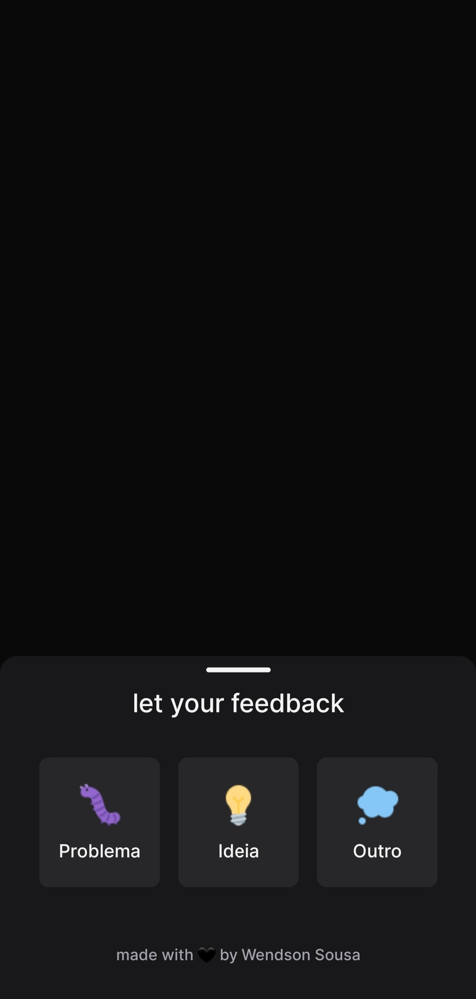

# NLW Return - Mobile



## 💻 Projeto

## Como executar

Clone o projeto e acesse sua pasta

```bash
$ git clone https://github.com/wendson13/nlw-return.git
$ cd nlw-return/mobile
```

Instale as dependências e execute o projeto com yarn ou npm

```bash
# instalar dependências
$ yarn
  ou
$ npm i

# executar o projeto
$ expo start
```
