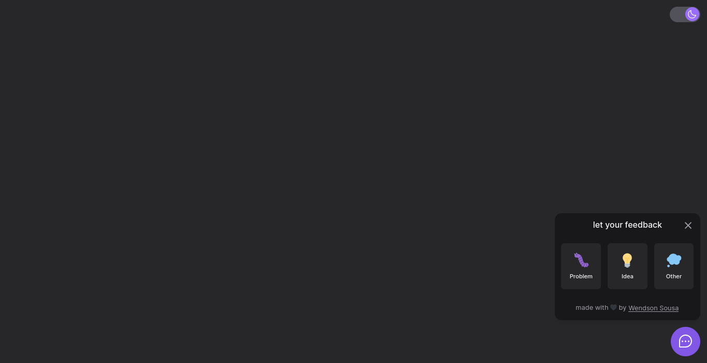

# NLW Return - Web



## 💻 Projeto

## Como executar

Clone o projeto e acesse sua pasta

```bash
$ git clone https://github.com/wendson13/nlw-return.git
$ cd nlw-return/web
```

Instale as dependências e execute o projeto com yarn ou npm

```bash
# instalar dependências
$ yarn
  ou
$ npm i

# executar o projeto
$ yarn dev
  ou
$ npm run dev
```
acesse o projeto em [localhost:3000](http://localhost:3000) em seu navegador.